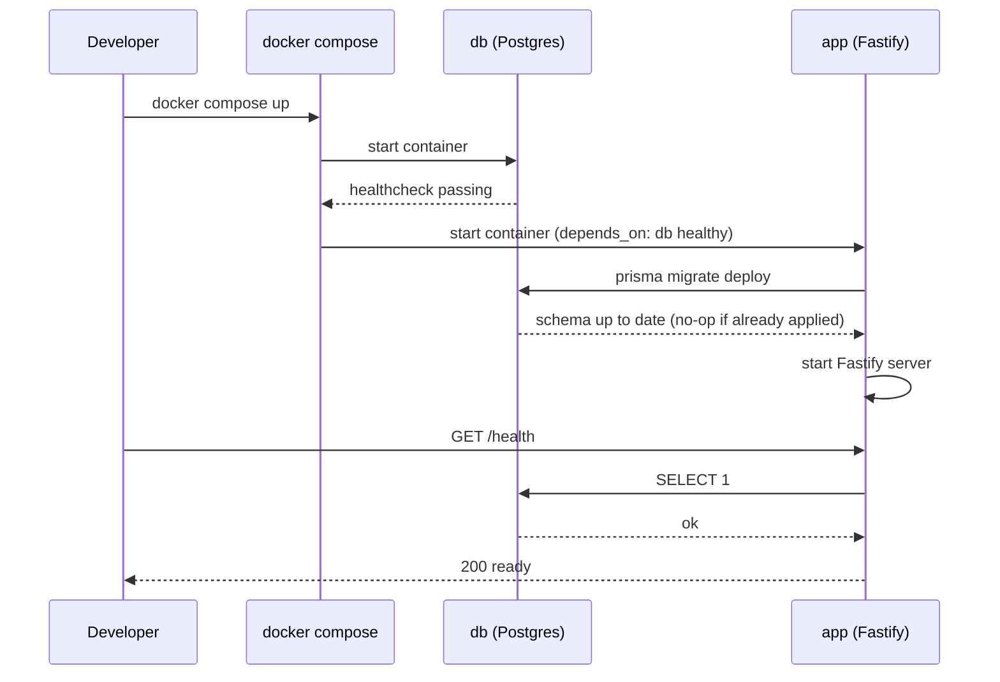

# Design: CH-01 — Application Scaffolding and Environment

## Inputs

- `proposal.md` (this change)
- `specs/project-environment/spec.md` (this change) — 5 requirements this design satisfies
- `docs/01-decisiones.md`, DEC-05 — fixes Node.js + TypeScript and PostgreSQL; explicitly defers the specific web framework and ORM/migration tool to this document
- `docs/00-contexto.md` §5 (rule 7 — secrets out of the repository) and §7 (Docker Compose deployment)

## Decisions deferred by DEC-05, resolved here

These are implementation-level choices within the stack DEC-05 already fixed, not a reopening of that decision.

### Web framework: Fastify

**Alternatives considered:** Express (most common, but no built-in schema validation or async-first design; every cross-cutting concern needs a separate package), NestJS (decorator-based, dependency-injection architecture — brings structure this skeleton does not need yet and conflicts with the project's own anti-over-engineering stance: CH-01 has no routes or business logic, only a readiness check).

**Decision:** Fastify. Native TypeScript types, async/await first, built-in JSON schema validation that will matter once CH-04 (query execution) introduces request/response shapes, and a plugin model that stays out of the way for a one-route skeleton.

**Resigned:** Fastify's plugin/encapsulation model has a learning curve past this change's scope; not relevant to CH-01, revisit if it becomes friction.

### ORM / migrations: Prisma

**Alternatives considered:** TypeORM (decorator-based, heavier, slower migration iteration), Drizzle (lighter, but migration tooling was less mature at the time of this decision), Knex (query builder with solid migrations but no typed schema/client).

**Decision:** Prisma 7 (stable `7.10.0`, pinned — the `8.0.0-rc.x` line available at implementation time is a release candidate that also pulls in an unrelated experimental dependency tree; avoided). Single schema file (`prisma/schema.prisma`) is the source of truth for the own database; `prisma migrate deploy` applies only pending migrations and is a no-op when none are pending, which directly satisfies the spec's idempotency requirement without extra scripting; generates a typed client for later changes (CH-05 consultas guardadas, etc.).

**Resigned:** Prisma's migration engine assumes it owns the schema; any manual schema edit outside a migration breaks drift detection. Acceptable — rule "own database via migrations only" already forbids manual edits.

**Prisma 7 architecture note (found during implementation, not obvious from the version number alone):** v7 removed `datasource.url` from `schema.prisma` and connection strings from the implicit environment lookup. Two consequences that shape the file layout below:

- A `prisma.config.ts` at the repo root (read by the Prisma CLI for `generate`/`migrate`) holds `datasource.url = env('DATABASE_URL')`, loaded via `dotenv/config` for local CLI runs outside Docker. **It must be `COPY`'d into the runtime Docker stage explicitly** — it lives at the repo root, not inside `prisma/`, so copying `./prisma` alone (as the Dockerfile's first draft did) silently omits it; without it, `prisma migrate deploy` inside the container falls back to schema-only resolution and fails with "datasource.url property is required" even though `DATABASE_URL` is correctly set in the container's environment. Found and fixed once Docker verification actually ran (see `docs/bitacora/`).
- The runtime `PrismaClient` no longer reads `DATABASE_URL` on its own. It takes an explicit **driver adapter** — `@prisma/adapter-pg` wrapping the `pg` driver — constructed from the same `DATABASE_URL`: `new PrismaClient({ adapter: new PrismaPg({ connectionString }) })`. Both `@prisma/adapter-pg` and `pg` are therefore runtime `dependencies`, not devDependencies.
- The generator block also changed: `provider = "prisma-client"` with a mandatory `output` path (`../src/generated/prisma`) — Prisma 7 no longer generates into `node_modules` by default, so the generated client is a source-tree output, gitignored like any other build artifact.

**Dependency hygiene (found during implementation):** `prisma@7.10.0` pulls in `mysql2` and `deepmerge-ts` transitively (Prisma's CLI bundles driver support for databases this project doesn't use, plus a config-merging helper); both had high-severity advisories at their resolved versions even though neither is reachable from our own code (we only use the `postgresql` provider). Pinned via `package.json` `overrides` to patched versions (`mysql2@3.24.4`, `deepmerge-ts@8.0.2`) rather than ignored — `npm audit` is clean.

## Docker Compose topology

Two services:

- `db` — `postgres:16-alpine`, named volume for data, healthcheck (`pg_isready`), environment from `POSTGRES_USER` / `POSTGRES_PASSWORD` / `POSTGRES_DB`.
- `app` — built from a local `Dockerfile` (Node.js LTS, TypeScript compiled at build time), `depends_on: db` with `condition: service_healthy`, environment from `.env` (see below), exposes `APP_PORT`.

`docker compose up` is the single command required by the spec: Compose starts `db`, waits for its healthcheck, then starts `app`. `app`'s container entrypoint runs migrations before starting the server (see next section) — this keeps "single command, no manual steps" true even on the very first run.

## Migrations

The `app` container entrypoint is a small script that:

1. Runs `npx prisma migrate deploy` against `DATABASE_URL`.
2. Starts the Fastify server only if step 1 exits 0.

This makes migrations part of every bring-up, not a separate manual step, and satisfies re-runnability: `migrate deploy` compares the migrations table to the migrations directory and applies only what's missing — running it again against an already-migrated database changes nothing and exits 0.

**No domain migrations in this change.** `docs/02-mapa-de-changes.md` requires the data model to be written before CH-02, not as part of CH-01. So `prisma/schema.prisma` starts with only `datasource`/`generator` blocks and zero models, and `prisma migrate deploy` in this change proves the pipeline (creates Prisma's own `_prisma_migrations` tracking table, applies nothing else, idempotent on rerun) rather than shipping any domain table. The first domain migration is CH-02's responsibility.

## Environment variables

| Variable | Used by | Purpose |
|---|---|---|
| `POSTGRES_USER` | `db` service | own-database superuser name |
| `POSTGRES_PASSWORD` | `db` service | own-database password |
| `POSTGRES_DB` | `db` service | own-database name |
| `DATABASE_URL` | `app` (Prisma) | full connection string composed from the three vars above |
| `APP_PORT` | `app` | port the Fastify server listens on |
| `NODE_ENV` | `app` | `development` / `production` switch for logging verbosity |

No other configuration value is read from a source file; all of the above are read from `process.env` at startup, not hardcoded.

## Secrets out of the repository

The repository is not yet a git repository (confirmed at exploration time). This change is responsible for:

1. `git init`.
2. A `.gitignore` that excludes `.env` (and standard `node_modules`, build output).
3. A committed `.env.example` with the six variables above, placeholder values only (e.g. `DATABASE_URL=postgresql://user:password@db:5432/zerodashboard`).
4. The real `.env` is created locally by copying `.env.example` and filling real values; it is never committed.

This is the concrete mechanism behind rule 7 and the "Secrets Excluded From the Repository" requirement.

## Readiness check

Fastify exposes `GET /health`. Handler runs a trivial query through the Prisma client (`SELECT 1`). Success → `200 { "status": "ready", "db": "connected" }`. Failure (query throws) → `503 { "status": "not-ready", "db": "unreachable" }`. This distinguishes "process is up" from "process can actually reach its own database," which is what the spec's verifiability requirement asks for.

## Bring-up sequence

## Scope check against the 5 requirements

| Requirement (spec.md) | Covered by |
|---|---|
| Reproducible Local Environment | Compose topology, entrypoint ordering |
| Own Database via Migrations | Prisma `migrate deploy` in entrypoint |
| Environment-Variable Configuration | Env variable table |
| Secrets Excluded From the Repository | `.gitignore` + `.env.example` |
| Verifiable Application Skeleton | `GET /health` |

## Out of scope (unchanged from proposal.md)

No tenant model, no connection registration, no query execution — those start at CH-02/CH-03. This design introduces no route beyond `/health`.
