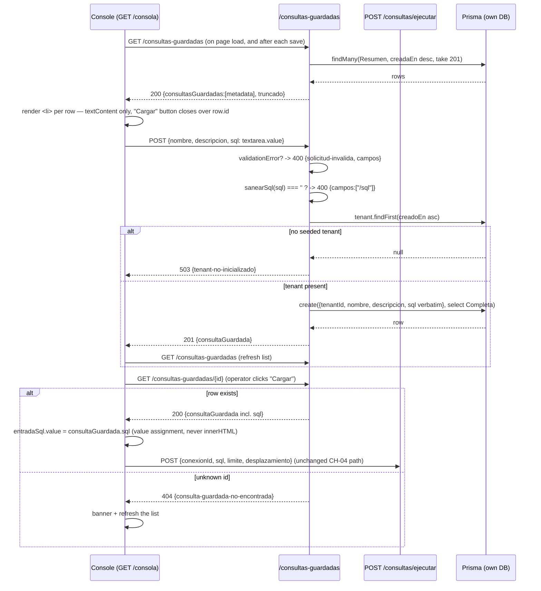

# Design: CH-05 — Saved Queries

## Inputs

- `proposal.md` (this change) and Engram `sdd/CH-05-saved-queries/proposal` (obs #53) — the two design-level scoping decisions it defers here are resolved as decisions 3 and 4 below
- `specs/saved-queries/spec.md` and `specs/query-console/spec.md` (this change) — written in parallel with this design. Two spec-level calls were pre-resolved by project precedent and are carried here as constraints, not re-derived: duplicate `nombre` is allowed, and the list carries metadata only
- `docs/01-decisiones.md` DEC-10, DEC-11, DEC-12 (firm, user-decided 2026-09-16 — cited, not re-opened), DEC-05 (design-level resolution precedent), DEC-06 (one seeded tenant); `docs/00-contexto.md` §5 rules 2, 4, 7
- CH-03 `design.md` (tenant resolution, `ConexionPublica` allowlist, `400`/`404`/`503` envelope) and CH-04 `design.md` (`sanearSql`, console rendering discipline, the `limite + 1` bounding trick)
- Actual source read before designing: `src/conexiones.ts`, `src/consultas.ts`, `src/consulta-ejecucion.ts`, `src/consola.ts`, `src/server.ts`, `src/conexiones.test.ts`, `prisma/schema.prisma`

## Decisions resolved at design level

Same class as CH-01's framework/ORM calls and CH-03/CH-04's route-shape calls under DEC-05: implementation choices inside already-fixed decisions, not new architecture gates.

### 1. `/consultas-guardadas` as a top-level collection, not a sub-path of `/consultas`

**Alternatives considered:** `/consultas/guardadas` — nests the new collection under the existing `/consultas` namespace. Rejected on two counts. `/consultas/ejecutar` is not a resource collection: `consultas` there is a namespace and `ejecutar` a verb, so there is no `/consultas` collection for a sub-resource to hang from, and a later `GET /consultas/:id` would collide with the literal `guardadas` segment. More importantly it would imply saved queries are a child of execution, which DEC-11 explicitly denies — `ConsultaGuardada` is a top-level Prisma model, a sibling of `Conexion`, with no `conexionId`.

**Decision:** the three routes mirror `/conexiones` exactly — a top-level plural collection named after the model, kebab-cased because the model name is two words (the same casing the repo already uses for two-word file names: `consulta-ejecucion.ts`, `db-probe.ts`).

| Route | Success | Failures |
|---|---|---|
| `POST /consultas-guardadas` | `201 { consultaGuardada }` (full row, `sql` included) | `400 solicitud-invalida`, `503 tenant-no-inicializado` |
| `GET /consultas-guardadas` | `200 { consultasGuardadas: [...], truncado }` (metadata only) | — |
| `GET /consultas-guardadas/:id` | `200 { consultaGuardada }` (full row) | `404 consulta-guardada-no-encontrada` |

Create returns the full row rather than the metadata projection: the caller just submitted the `sql`, so echoing it discloses nothing new, and the console can confirm what was stored. No update, no delete (DEC-10).

### 2. `src/consultas-guardadas.ts`, amending the proposal's tentative `src/consulta-guardada.ts`

The proposal named the module `src/consulta-guardada.ts`. Reading the actual files shows that is the wrong half of the convention: **route modules are named after the collection they serve and match their route path** (`conexiones.ts` ↔ `/conexiones`, `consultas.ts` ↔ `/consultas/...`), while **singular compound names belong to non-route engine modules** (`consulta-ejecucion.ts`, `db-probe.ts`, `pg-error.ts`). This module is a route module.

**Decision:** the file is `src/consultas-guardadas.ts`; the export is `registerConsultaGuardadaRoutes(app, prisma): void`, singular-entity + `Routes` exactly like `registerConexionRoutes` and `registerConsultaRoutes`. `sdd-tasks` must use this name, not the proposal's.

Two `select` allowlists are exported, mirroring `ConexionPublica`'s shape:

```ts
export const ConsultaGuardadaResumen = {
  id: true, nombre: true, descripcion: true, creadaEn: true, actualizadaEn: true,
} as const;

export const ConsultaGuardadaCompleta = { ...ConsultaGuardadaResumen, sql: true } as const;
```

**Stated plainly so the pattern is not misread:** `ConexionPublica` exists as a *security* mechanism — it keeps `credencial` un-fetched so no read path can echo it. `ConsultaGuardada` has no secret column, so these two selects are a **payload-shape** device (decision 3), not a secret container. `tenantId` is absent from both for a different reason: it is server-resolved state, and no response has any use for it.

`src/server.ts` gains one import and one `registerConsultaGuardadaRoutes(app, prisma)` call beside the three existing registrations. `registerConsolaRoute(app)` keeps its no-`prisma` signature: the page still touches no database of ours, it only calls the API from the browser.

### 3. The list carries metadata only, newest first, hard-capped at 200 with an explicit truncation flag

Proposal design-decision 1, resolved in three parts.

**Payload.** `ConsultaGuardadaResumen` — no `sql`. Load-into-editor is therefore a second call to get-by-id, which is the flow the console spec already describes. Rejected: shipping `sql` in the list, which would make the list payload grow with statement length for a page that renders names.

**Ordering.** `orderBy: [{ creadaEn: 'desc' }, { id: 'asc' }]`. Newest first because the console's save flow expects the row it just created at the top; `id` as a tiebreaker because `creadaEn` is millisecond-precision and two creates in the same millisecond (routine in a test) would otherwise have no total order.

**Cap.** `take: LIMITE_LISTADO + 1`, slice to `LIMITE_LISTADO = 200`, report `truncado: boolean` — the same `limite + 1` bounding trick CH-04 decision 6 uses, for the same reason (one query, no second `count(*)`).

The cap is not R0 pessimism: **DEC-10 removes delete, so this table only ever grows**, and an uncapped `findMany` would be unbounded over the product's life. 200 matches `/consultas/ejecutar`'s `limite` ceiling. The flag is named `truncado`, deliberately **not** CH-04's `hayMas`: `hayMas` pairs with `siguienteDesplazamiento` and promises a next page, and DEC-10 allows no pagination parameters here. `truncado` names what actually happened — the list was cut and there is currently no way to see past it. Silent truncation was rejected outright; this codebase's design culture refuses silent outcomes.

### 4. Duplicate `nombre` is allowed, and the console is designed around that

Proposal design-decision 2. `Conexion.nombre` carries no uniqueness constraint, and adding one to `ConsultaGuardada` would be a migration — which DEC-11 forecloses and which, under `docs/01-decisiones.md`'s standing rule that no agent takes an architecture decision, would need a new DEC first.

**Decision:** duplicates are accepted. Two creates with the same `nombre` both return `201` with distinct ids and both appear in the list; a test pins this so it reads as designed behavior rather than a missing constraint. The consequence is carried into the UI rather than ignored: the list renders `creadaEn` beside `nombre`, and load-into-editor is keyed on the row `id`, never on its name.

### 5. Validation mirrors `conexiones.ts` exactly, and `sql` is stored verbatim

```ts
const registroConsultaGuardadaSchema = {
  type: 'object',
  additionalProperties: false,
  required: ['nombre', 'sql'],
  properties: {
    nombre: { type: 'string', minLength: 1 },
    descripcion: { type: ['string', 'null'] },
    sql: { type: 'string', minLength: 1 },
  },
} as const;
```

Registered as `{ schema: { body: … }, attachValidation: true }`, with the handler's first branch mapping `request.validationError` through `camposInvalidos()` to `400 { error: 'solicitud-invalida', campos: [...] }` — field paths only, never values.

- **`camposInvalidos` is imported from `./conexiones.js`**, exactly as `src/consultas.ts:3` already does. Considered and rejected: extracting it to a new `src/validacion.ts`. It is the tidier home, but it would edit two working files for zero behavior change inside a change that already has a console rewrite in it. Noted as a cleanup for whichever change next needs a third caller.
- **No `maxLength` anywhere**, because `conexiones.ts` has none and adding the convention here would leave it half-applied across the codebase. The real bound already exists: Fastify's default `bodyLimit` of 1 MiB rejects an oversized body before validation.
- **`additionalProperties: false` is what enforces rule 2.** A body carrying `tenantId` is rejected as an unknown property; the tenant is resolved server-side by `prisma.tenant.findFirst({ orderBy: { creadoEn: 'asc' }, select: { id: true } })`, `503 { error: 'tenant-no-inicializado' }` when the table is empty — the CH-03 decision-4 mechanism, unchanged.
- **Whitespace-only `sql` is a request-shape failure**, not a stored row: the handler reuses `sanearSql` from `./consulta-ejecucion.js` **as a predicate only** — `if (sanearSql(body.sql) === '') return 400 { campos: ['/sql'] }` — which is the same guard `src/consultas.ts:46` applies before execution, so a statement that could never execute can never be saved.
- **But the stored value is `body.sql` untouched.** `sanearSql` strips one trailing `;`; that is an execution-path concern owned by CH-04's pagination wrapper, and applying it here would silently rewrite the operator's statement in the database. Rule 4 calls the stored `sql` persisted text, so it is persisted as submitted and re-sanitized at execution time. A round-trip test pins this.
- **`descripcion` has exactly one representation of absence.** Omitted, `null`, and blank-or-whitespace all persist as `null` (`const descripcion = (body.descripcion ?? '').trim() === '' ? null : body.descripcion`), the same treatment `sanearSql` gives a whitespace-only statement and the same shape as `soloLectura: body.soloLectura ?? true` in `conexiones.ts:118`.

### 6. Get-by-id takes no params schema and answers `404` for every id it cannot find

**Precedent, followed literally:** `POST /conexiones/:id/prueba` (`src/conexiones.ts:127`) declares no params schema at all — it calls `findUnique({ where: { id: request.params.id } })` and returns `404 { error: 'conexion-no-encontrada' }` on `null`. `src/consultas.ts:64` returns the same body for the same reason.

**Decision:** same shape, with `404 { error: 'consulta-guardada-no-encontrada' }` — `<recurso>-no-encontrada`, feminine to agree with *consulta guardada*. A malformed id is not a distinct case: `ConsultaGuardada.id` is `String @id @default(uuid())` with **no `@db.Uuid`**, so the Postgres column is `text` and `findUnique` performs a plain text equality that cannot throw on a non-UUID string. A nonexistent id and a malformed id are both honestly "no such saved query"; a params-format schema would only invent a second way to say it.

### 7. Read paths are not tenant-scoped, and that is deliberate — `503` applies to create only

`503 tenant-no-inicializado` exists on `POST` because the create needs a tenant id for a **required foreign key**, exactly as CH-03 decision 4 framed it. It is not an isolation mechanism.

**Decision:** the two `GET` paths resolve no tenant and apply no `tenantId` filter. **No existing read path in this codebase filters by tenant** — neither `/conexiones/:id/prueba` nor `/consultas/ejecutar` does — and T1/T2/T4 (real isolation, and the two-tenant test that proves it) are CH-06's whole content. Adding a filter on these two paths would half-implement CH-06 in an inconsistent subset of the API and would make CH-06's work harder to review, not easier. An empty saved-queries table therefore lists `[]`, not `503`: an empty list is the honest answer to "what is saved", and only the create genuinely needs a tenant to exist. Recorded under known limits.

## Contracts

```jsonc
// POST /consultas-guardadas  (Fastify JSON schema; additionalProperties: false, attachValidation: true)
{ "nombre": "Stock producible", "descripcion": "Insumos vs recetas", "sql": "SELECT 1" }
// descripcion optional and nullable; omitted / null / blank all persist as null.
// A body carrying tenantId is rejected by additionalProperties: false.

// 201
{ "consultaGuardada": { "id": "…", "nombre": "…", "descripcion": null,
                        "sql": "SELECT 1", "creadaEn": "…", "actualizadaEn": "…" } }

// GET /consultas-guardadas — 200, metadata only, newest first, at most 200 rows
{ "consultasGuardadas": [ { "id": "…", "nombre": "…", "descripcion": null,
                            "creadaEn": "…", "actualizadaEn": "…" } ],
  "truncado": false }                       // no `sql` field exists on a list row

// GET /consultas-guardadas/:id — 200
{ "consultaGuardada": { "id": "…", "nombre": "…", "descripcion": "…",
                        "sql": "SELECT 1", "creadaEn": "…", "actualizadaEn": "…" } }

// Failures — the existing envelopes, unchanged
400 { "error": "solicitud-invalida", "campos": ["/nombre"] }
404 { "error": "consulta-guardada-no-encontrada" }
503 { "error": "tenant-no-inicializado" }
```

There is no credential on any path in this module and no outbound dial to a tenant's replica, so CH-03's credential-safety boundary is not engaged here. The sanitized-logging rule still holds by default: this module logs nothing, because it produces no third-party driver error to sanitize.

## Flow



## Console changes (DEC-12)

`src/consola.ts` is one self-contained document constant; these are edits inside it, adding no dependency, no build step and no third-party script origin.

**Markup — a new `<section id="guardado">` between `</form>` and `<p id="banner">`.** It holds `<input id="nombre">`, `<input id="descripcion">`, `<button id="guardar" type="button">`, and `<ul id="guardadas">`.

Three concrete constraints that decide this placement, each read off the current file:

1. **`type="button"` is load-bearing.** `#ejecutar` is `type="submit"` inside `#formulario`, and the form's submit handler calls `ejecutar(0)`. A save button that inherited the default `type="submit"` would execute the query instead of saving it.
2. **The save inputs stay outside `#formulario`.** `#conexion` and `#sql` are `required`; putting name/description in the same form invites marking them `required` too, which would make browser validation block *execution* until a name is typed.
3. **The banner is reused, not duplicated.** `#banner` is already `role="alert"` and `textContent`-only, and it sits directly below the new section. One alert region shows one message at a time — a save failure and an execution failure overwrite each other, which is accepted and simpler than a second alert region.

**Script — new functions in the file's existing vanilla style** (`var`, string concatenation, plain callbacks, no template literals so the document survives inside the TypeScript template literal):

- `listarGuardadas()` — `fetch('/consultas-guardadas')`, then `renderizarGuardadas(cuerpo)`. Called once at script end and after every successful save. Wrapped in the same try/catch → `mostrarBanner` shape as `ejecutar`, so a failed initial list never breaks the execute path.
- `renderizarGuardadas(cuerpo)` — `vaciar(listaGuardadas)` (the existing helper, `src/consola.ts:130`), then per row build `<li>` → `<span>` with `nombre`, `<span>` with `creadaEn`, `<span class="ayuda">` with `descripcion`, and a `<button type="button">` bound by a closure over `fila.id`. **Every one of those is `textContent`** — a stored `<script>` in a `nombre` must render as visible text, never execute. When `cuerpo.truncado` is true, a final non-interactive `<li>` says only the most recent ones are shown.
- `guardar()` — POST `{nombre, descripcion, sql: entradaSql.value}`, disabling `#guardar` for the round trip exactly as `ejecutar` disables `#ejecutar`. On `201`: clear `#nombre`/`#descripcion` and call `listarGuardadas()`. Failure branches follow `ejecutar`'s existing order and wording — `fetch` rejection, non-JSON body, `400` (reusing the existing "revise estos campos" message), `503` (new literal: no tenant is initialized), any other non-`201`.
- `cargarGuardada(id)` — `fetch('/consultas-guardadas/' + encodeURIComponent(id))`; on `200`, `entradaSql.value = cuerpo.consultaGuardada.sql` and focus the textarea, leaving `#conexion` untouched so the operator picks the connection (DEC-11: nothing binds them). On `404`, banner plus `listarGuardadas()` to drop the stale row.

`MENSAJES` is not extended: it maps `{fase, categoria}` execution verdicts, and none of these are execution verdicts. CSS gains only `#guardadas { list-style: none; padding: 0; }` and a flex row rule.

## File changes

| File | Action | Description |
|---|---|---|
| `src/consultas-guardadas.ts` | Create | `registerConsultaGuardadaRoutes(app, prisma)` — the three routes, the body schema, `ConsultaGuardadaResumen`/`ConsultaGuardadaCompleta`, `LIMITE_LISTADO`, server-side tenant resolution. Imports `camposInvalidos` from `./conexiones.js` and `sanearSql` from `./consulta-ejecucion.js`. |
| `src/consultas-guardadas.test.ts` | Create | Integration cases via `app.inject()` against live PostgreSQL, skipping when unreachable — `src/conexiones.test.ts`'s convention. |
| `src/consola.ts` | Modify | The `<section id="guardado">` markup, three CSS rules, and the four script functions above. |
| `src/server.ts` | Modify | One import + one `registerConsultaGuardadaRoutes(app, prisma)` call. |
| `scripts/smoke.sh` | Modify | End-to-end save → list → get → execute, per the testing strategy. |

**No dependency is added and no schema change is made** (DEC-11). `prisma/schema.prisma` is untouched: `ConsultaGuardada` has fit since CH-02. `package.json`, `src/config.ts` and `.env.example` are untouched — this change introduces no new budget or tunable.

## Testing strategy

There is **no unit layer**: unlike CH-03/CH-04 this module contains no pure classifier or sanitizer to test in isolation — it is routes plus Prisma, so the meaningful coverage is integration through `app.inject()`, which is exactly what `src/conexiones.test.ts` established. Same live-Postgres-or-skip convention: `TEST_DB_*` env with `.env.example` defaults, a one-socket `esAlcanzable()` TCP preflight at module top level, and `describe(..., { skip: … })` with a reason so `npm test` stays runnable without Docker. The preflight is extended with a second condition — a `tenant.findFirst()` that folds "no seeded tenant" into the same skip reason, since every create depends on DEC-06's seeded row. Cleanup is `after` → `deleteMany({ where: { id: { in: creadas } } })`, `$disconnect`, `app.close()`.

| Layer | What | Approach |
|---|---|---|
| Integration | Create persists | `POST` → `201`, full row echoed, row readable by get-by-id |
| Integration | `descripcion` absence | Omitted, explicit `null`, and blank-only all yield `descripcion: null` |
| Integration | Incomplete create | `nombre` omitted → `400 solicitud-invalida` with at least one field path, **and `count({where:{nombre}}) === 0`** — mirrors `conexiones.test.ts`'s "creates no row" case |
| Integration | Rule 2 | A body carrying `tenantId` → `400` (unknown property), no row created. Pins the "a request cannot set `tenantId`" criterion |
| Integration | Empty statement | `sql` of `"   "` and of `";"` → `400 { campos: ['/sql'] }`, no row created |
| Integration | Verbatim storage (decision 5) | Create `"  SELECT 1;  "` → get-by-id returns that string byte-identical, un-trimmed and with its `;` |
| Integration | List is metadata only | The created row appears and `assert.ok(!('sql' in fila))`; the raw body does not contain the stored statement text |
| Integration | List ordering | Two creates → newest first; `truncado === false` |
| Integration | List cap (decision 3) | `createMany` of `LIMITE_LISTADO + 1` rows under a unique `nombre` prefix → exactly `LIMITE_LISTADO` rows and `truncado === true`; cleaned up by prefix |
| Integration | Duplicate `nombre` (decision 4) | Two creates, same `nombre` → both `201`, distinct ids, both listed |
| Integration | Get-by-id | Known id → `200` with `sql`; unknown id → `404 consulta-guardada-no-encontrada`; a malformed non-UUID id → `404`, not `500` |
| Integration | R0 closure round trip | Register a `Conexion`, save `SELECT 1`, get it by id, `POST /consultas/ejecutar` with that `sql` → `200 {resultado:'ok'}`. One app instance with all three `register*Routes` registered. Pins DEC-11 and decision 5 together — "escribir una consulta, guardarla y ejecutarla" |
| Smoke | End-to-end | Extend `scripts/smoke.sh` with save → list → get → execute inside the Compose network |
| Manual | Console (DEC-12) | Save the current statement, see it appear in the list, load it back into the editor and execute it; and a saved query whose `nombre` is `<script>alert(1)</script>` renders as visible text and executes nothing |

## Threat matrix

| Boundary | Applicability | Reason |
|---|---|---|
| Documentation-like paths | N/A | No file is classified or executed by this change. |
| Git repository selection | N/A | No VCS invocation. |
| Commit state | N/A | No VCS invocation. |
| Push state | N/A | No VCS invocation. |
| PR commands | N/A | No PR automation. |

No shell command, subprocess, VCS/PR automation, executable-file classification or process integration is added. The genuine adversarial boundaries of this change are named and handled above:

- **Stored text re-rendered in the operator's browser.** A saved `nombre` or `descripcion` is operator-authored, but it is *persisted and replayed later*, which is a stored-input surface whether or not the author is trusted. Every list field is assigned through `textContent` and the `sql` reaches the editor as `textarea.value`, never as markup — CH-04 decision 8's mechanism, extended to a second data source.
- **Rule 4.** This change builds no SQL by concatenation: `sql` is a Prisma-bound column value on the way in and, on the way out, goes through CH-04's parameterized read-only wrapper untouched by this module.
- **Rule 2.** `additionalProperties: false` is the mechanism, not a convention — a client-supplied `tenantId` is rejected before any handler logic runs, and a test pins it.
- **Credential exposure is not in scope here**: `ConsultaGuardada` has no secret column and this module opens no outbound connection.

## Migration / rollout

No migration and no schema change (DEC-11): `prisma/schema.prisma` is not edited and CH-02's `ConsultaGuardada` is used exactly as delivered. No new dependency, no build change, no new env var. Rollback is reverting the commit — one new module, one new test, one import and one call in `src/server.ts`, and the `src/consola.ts` edits. Rows written here are orphaned but harmless in a table that predates this change, and CH-01–CH-04 behavior is untouched.

## Scope check against the proposal's success criteria

| Criterion (`proposal.md`) | Covered by |
|---|---|
| A saved query persists with `nombre`/`descripcion`/`sql` for the seeded tenant and appears in the list | Decisions 1, 3, 5; `POST` → `201` with server-resolved `tenantId`, then `GET` newest-first |
| Get-by-id returns the stored statement; an unknown id returns a legible `404` | Decisions 1 and 6; `404 { error: 'consulta-guardada-no-encontrada' }`, the `conexion-no-encontrada` shape |
| A create missing `nombre` or `sql`, or carrying an unknown property, returns `400 solicitud-invalida` with field paths | Decision 5: `required`, `additionalProperties: false`, `attachValidation: true`, `camposInvalidos()` |
| A request cannot set `tenantId` | Decision 5: `additionalProperties: false` rejects it; the tenant is resolved by `tenant.findFirst` (rule 2). Pinned by its own test |
| In the console, a statement is saved, appears in the list, and loads back into the editor ready to execute | Console changes (DEC-12): `guardar()` → `listarGuardadas()` → `cargarGuardada(id)` → `entradaSql.value`, with `#conexion` left for the operator per DEC-11 |
| Proposal design-decision 1 — list payload, ordering, row cap | Decision 3 |
| Proposal design-decision 2 — duplicate `nombre` | Decision 4 |

## Known limits (stated, not prevented)

- **Reads are not tenant-scoped** (decision 7). Consistent with every other read path in the codebase; T2's two-tenant isolation test is CH-06's, and this is one more call site it will have to cover.
- **Past 200 saved queries, older rows are unreachable** — `truncado: true` says so, but DEC-10 allows no pagination parameter to see past it. Compounded by the absence of delete: the table only grows. Revisit with B4/CH-25.
- **A saved query with a wrong name or a stale statement cannot be corrected in place** (DEC-10's accepted cost); the only remedy in R0 is saving another one, which decision 4 permits.
- **A saved statement may fail against a connection with a different schema** (DEC-11's accepted cost). Nothing validates compatibility, and nothing can: the pairing is chosen at execution time.
- **Duplicate names are indistinguishable by name alone**; the console mitigates by rendering `creadaEn` and keying on `id`, but two identically-named rows still look alike in a list.

## Out of scope (unchanged from proposal.md)

Update and delete (DEC-10; B4 versioning → CH-25), binding a saved query to a `Conexion` (DEC-11; no schema change at all), B3 user-declared query parameters (CH-11), A2 credential encryption at rest (CH-07), T1/T2/T4 tenant CRUD, isolation and active-tenant indicator (CH-06), and persisting execution results (gate D-1 stays open). No P2 surface, no authentication, no pagination parameters on the list.
