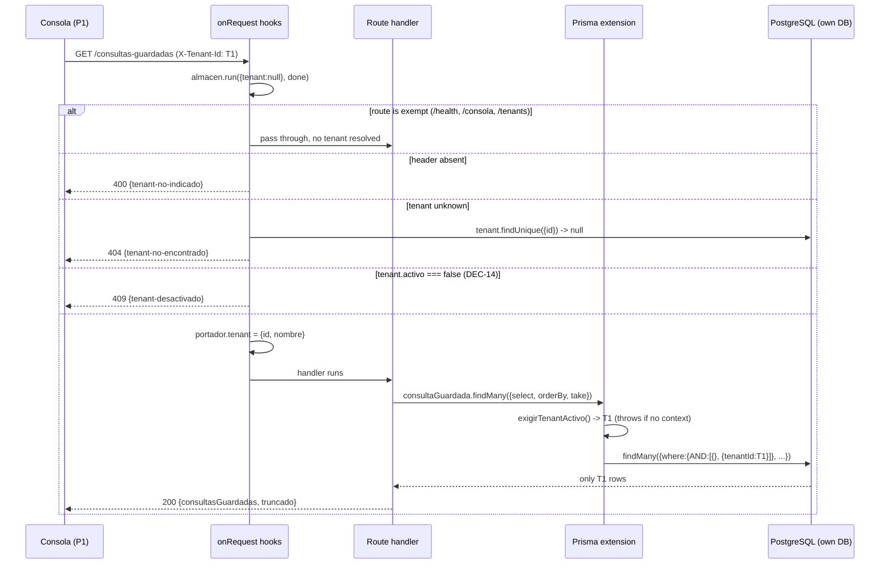

# Design: CH-06 — Tenants and Isolation

## Inputs

- `proposal.md` (this change) and Engram `sdd/CH-06/proposal` — the three design-level scoping decisions it defers here are resolved as decisions 1, 3 and 6 below.
- `explore.md` (this change) — the exact unfiltered read paths: `src/consultas-guardadas.ts:143` and `:165`, `src/conexiones.ts:178`, `src/consultas.ts:52`; the two `tenant.findFirst` placeholders at `src/conexiones.ts:147` and `src/consultas-guardadas.ts:106`.
- `docs/01-decisiones.md` DEC-13 (Prisma extension + `AsyncLocalStorage`), DEC-14 (frozen deactivation), DEC-15 (explicit per-request tenant) — **firm, cited, not re-opened**; DEC-06 (tenant model shape), DEC-04 (P1 is the sole console operator), DEC-08/DEC-09 (this project prefers a structural guarantee over a convention), DEC-05 (design-level resolution precedent).
- Specs: `specs/` does not exist at design time (`sdd-spec` runs in parallel); this design is derived from the proposal's capability list and converges with the specs at `sdd-tasks`.
- Source read before designing: `src/conexiones.ts`, `src/consultas-guardadas.ts`, `src/consultas.ts`, `src/consola.ts`, `src/server.ts`, `src/conexiones.test.ts`, `prisma/schema.prisma`, `prisma/seed.ts`, `package.json` (Prisma 7.10, Fastify 5.12). **No request-context or middleware pattern exists in `src/` — this change introduces the first one.**

## Technical approach

Three new modules, no new dependency (`node:async_hooks` is built in). The active tenant enters through a header, is validated once by a Fastify `onRequest` hook pair, is carried in `AsyncLocalStorage`, and is injected into every `Conexion`/`ConsultaGuardada` query by a Prisma Client Extension. Route handlers stop mentioning tenants entirely: the four unfiltered lookups keep their current code and become scoped without a single `where: { tenantId }` written by hand.

```
request ──▶ [onRequest #1: almacen.run(portador, done)]      ← enters the async context
            [onRequest #2: exempt? resolve header, validate] ← 400 / 404 / 409 envelopes
                     │ portador.tenant = { id, nombre }
                     ▼
              route handler (CH-03/04/05 code, unchanged)
                     │ prisma.conexion.findUnique({ where: { id } })
                     ▼
            [extension: exigirTenantActivo() → inject tenantId]  ← throws if no context
                     ▼                    PostgreSQL (own DB)
```

## Decisions resolved at design level

Same class as DEC-05 and CH-05's design decisions: mechanics inside already-fixed architecture decisions, not new gates.

### 1. The active tenant travels in an `X-Tenant-Id` request header (proposal decision 1)

| Option | Trade-off | Verdict |
|---|---|---|
| `X-Tenant-Id` header | Orthogonal to routing; every existing URL keeps its shape; one exemption list covers all routes and every future one | **Chosen** |
| Route prefix `/t/:tenantId/...` | Rewrites every path in CH-03/04/05, the console and `scripts/smoke.sh`; the tenant becomes a per-route params concern; breaks "CH-03/04/05 behavior is unchanged" | Rejected |
| Body field | Impossible on `GET`; would re-open rule 2's body-level prohibition the schemas currently enforce | Rejected |

DEC-15 already permits an explicit per-request tenant from the console (P1, DEC-04); the header is the smallest shape that carries it. `additionalProperties: false` / `propertyNames` stay exactly as they are — a `tenantId` **in a body** remains a `400`, because the header is the only channel.

**Exemptions** are a closed allowlist matched on `request.routeOptions.url` (the route pattern, never a raw-URL prefix test, so `/consola-falsa` cannot pose as `/consola`):

| Route pattern | Why exempt |
|---|---|
| `GET /health` | Liveness has no tenant and must answer before any tenant exists |
| `GET /consola` | Static document; the page *is* where the operator picks a tenant |
| `/tenants` (all methods) | Bootstrap: requiring a tenant to create the first tenant is unsatisfiable |

Everything else is scoped **by default**, including any route added later and any unmatched URL — an unmatched URL with no header answers `400` before the `404`, which is fail-closed and leaks nothing.

**Failure envelopes** follow the existing `{ error: 'kebab-case' }` style:

| Condition | Response | Why this status |
|---|---|---|
| Header absent or empty | `400 { "error": "tenant-no-indicado" }` | There is no authentication subject (DEC-04), so this is a malformed request, not a `401`. A distinct code — not `solicitud-invalida` — lets the console map it to one message without parsing `campos` |
| No `Tenant` row with that id | `404 { "error": "tenant-no-encontrado" }` | The `conexion-no-encontrada` / `consulta-guardada-no-encontrada` precedent, masculine to agree with *tenant* |
| `Tenant.activo === false` | `409 { "error": "tenant-desactivado" }` | DEC-14 freezes the tenant but keeps its rows; `404` would erase the very distinction the decision exists to make, and `403` would claim an authorization verdict no subject exists for. `409` states the request conflicts with the resource's current state. `423 Locked` was rejected as WebDAV exotica |

Both hooks return before any handler logic, which is DEC-14's "rejected before any handler logic" read literally.

### 2. `src/contexto-tenant.ts` — the context primitive

Singular compound name, matching the non-route engine modules (`consulta-ejecucion.ts`, `db-probe.ts`, `pg-error.ts`); `src/tenants.ts` stays a pure route module like `conexiones.ts`.

```ts
export interface TenantActivo { readonly id: string; readonly nombre: string; }
interface Portador { tenant: TenantActivo | null; }

const almacen = new AsyncLocalStorage<Portador>();

export class ErrorSinTenantActivo extends Error {}          // programmer error, not a 4xx

/** Throws `ErrorSinTenantActivo` when called outside a tenant-bearing request. */
export function exigirTenantActivo(): TenantActivo;
export function tenantActivoOpcional(): TenantActivo | null; // tests and diagnostics only
/** Test/seed helper: runs `fn` inside a context. The hook is the only production entry. */
export function conTenantActivo<T>(tenant: TenantActivo, fn: () => Promise<T>): Promise<T>;
/** Registers BOTH onRequest hooks. MUST be called before any `register*Routes`. */
export function registrarContextoTenant(app: FastifyInstance, prisma: PrismaClient): void;
```

A **mutable `Portador`** — not the tenant itself — is the store, because the store must be entered synchronously while resolution is asynchronous:

```ts
app.addHook('onRequest', (_request, _reply, done) => { almacen.run({ tenant: null }, done); });
app.addHook('onRequest', async (request, reply) => { /* exempt? / resolve / validate / portador.tenant = … */ });
```

Callback-style `run(store, done)` in `onRequest` is the mechanism `@fastify/request-context` itself uses: the context entered there propagates through the rest of Fastify's async chain. Registration order is load-bearing — same-name hooks run in registration order, so `registrarContextoTenant` goes first in `src/server.ts` and in every test app. Rejected: a `preHandler` hook (runs after body validation, so a scoped query in a future `preValidation` would escape) and decorating `request` (invisible to Prisma, which is the whole point of DEC-13).

### 3. The extension fails closed, by an operation allowlist (proposal decision 2)

`src/aislamiento-prisma.ts`:

```ts
const MODELOS_AISLADOS = new Set(['Conexion', 'ConsultaGuardada']);

export function extenderConAislamiento(prisma: PrismaClient) {
  return prisma.$extends({ query: { $allModels: { async $allOperations({ model, operation, args, query }) {
    if (!MODELOS_AISLADOS.has(model)) return query(args);
    const { id: tenantId } = exigirTenantActivo();            // ← throws, never skips
    return query(aplicarAlcance(operation, args, tenantId));  // ← throws on unknown operation
  } } } });
}
export type PrismaAislado = ReturnType<typeof extenderConAislamiento>;
```

`aplicarAlcance` is a **closed map**, and an operation absent from it throws `ErrorAislamientoNoSoportado`:

| Operations | Injection |
|---|---|
| `create` | `data.tenantId = tenantId` (overwriting any supplied value) |
| `createMany`, `createManyAndReturn` | the same on every entry of `data` |
| `findMany`, `findFirst`, `findFirstOrThrow`, `count`, `aggregate`, `groupBy`, `updateMany`, `deleteMany` | `where = { AND: [where ?? {}, { tenantId }] }` |
| `findUnique`, `findUniqueOrThrow`, `update`, `delete` | `where = { ...where, tenantId }` — legal since Prisma 5's extended `WhereUniqueInput`, and this project is on 7.10 |
| `upsert`, `aggregateRaw`, anything unlisted | **throws** — `upsert` needs both a scoped `where` and a scoped `create`, and no route uses it; the day one does, it gets a deliberate line here |

Three properties make this load-bearing rather than defensive, which the proposal's risk 3 demands:

- **No context is a thrown error, never an unfiltered query.** `exigirTenantActivo()` throws before `query(args)` is ever reached. A handler that somehow runs outside the hook chain gets a `500`, which is loud; a silent unfiltered `findMany` is exactly the cross-tenant leak T2 exists to prevent. Fail-open here would make DEC-13's accepted single point of failure fail *silently*, and T2's test is only a backstop for what the test authors thought to exercise.
- **An unanticipated operation is also a thrown error.** The allowlist inverts the default: a future contributor's `upsert` fails in their first test run instead of quietly crossing tenants in production.
- **`AND`-wrapping, not `where.tenantId = …` spreading, on filter operations.** A caller-supplied `tenantId` (or an `OR` that would widen the filter) cannot displace the injected one — the injected predicate is conjoined at the top level and always applies.

**Known limits, stated not prevented**: `$queryRaw`/`$executeRaw` bypass model-level extensions. Nothing in this project raw-queries its own database, and `src/consulta-ejecucion.ts` talks to the *tenant's* replica through `pg`, which is a different database outside this boundary. Nested writes through a relation are likewise unreached — no route uses them. Both are recorded as the residual surface of DEC-13's single point of failure.

### 4. The extended client's type is propagated, not cast away

`prisma.$extends()` returns a client type that is not `PrismaClient`. Rather than casting at the boundary (which would hide exactly the mechanism this change adds), `PrismaAislado` is exported and the four route modules change their parameter type from `PrismaClient` to `PrismaAislado`. `src/server.ts` builds `const prisma = extenderConAislamiento(new PrismaClient({ adapter }))`, and **the raw client is not kept in scope** — there is no un-scoped handle for a handler to reach for. `Tenant` is not in `MODELOS_AISLADOS`, so `src/tenants.ts` and the resolution hook use the same extended client with no escape hatch. Every test builds its client the same way, so the tests exercise the real extension (no mocking, per the standing convention).

### 5. `src/tenants.ts` — three routes, mirroring `conexiones.ts` exactly

| Route | Success | Failures |
|---|---|---|
| `POST /tenants` | `201 { tenant }` | `400 solicitud-invalida` |
| `GET /tenants` | `200 { tenants: [...] }` — `activo: true` only, unless `?incluirInactivos=true` | — |
| `POST /tenants/:id/baja` | `200 { tenant }` (`activo: false`) | `404 tenant-no-encontrado`, `409 tenant-desactivado` (already down) |

`export const TenantPublico = { id: true, nombre: true, activo: true, creadoEn: true } as const;` — a payload-shape allowlist in the `ConsultaGuardadaResumen` sense; `Tenant` has no secret column.

Body schema copies `registroConsultaGuardadaSchema`'s shape verbatim, including `propertyNames` (measured in CH-05: Fastify's default `removeAdditional: true` makes `additionalProperties: false` alone silently *drop* unknown keys):

```ts
{ type: 'object', additionalProperties: false, propertyNames: { enum: ['nombre'] },
  required: ['nombre'], properties: { nombre: { type: 'string', minLength: 1 } } }
```

with `attachValidation: true` and `camposInvalidos()` imported from `./conexiones.js`, exactly as `consultas.ts` and `consultas-guardadas.ts` already do. Deactivation is `POST /tenants/:id/baja` rather than `DELETE /tenants/:id`: DEC-14's baja is a state transition that keeps the row, and `DELETE` would promise removal. Re-activation does not exist (DEC-14), so there is no `POST /tenants/:id/alta`. Duplicate `nombre` is allowed — no uniqueness constraint exists anywhere in the schema, and adding one is an unregistered decision.

### 6. `503 tenant-no-inicializado` is deleted, not repurposed (proposal decision 3)

It existed for one reason (CH-03 decision 4, repeated in CH-05 decision 5): the create path needed *some* tenant id for a NOT NULL foreign key and the table could be empty. After CH-06 the tenant is named by the request and validated by the hook before the handler runs, so both `tenant.findFirst` placeholders disappear and the condition is unreachable on those routes — an empty table now produces `404 tenant-no-encontrado`, which is the truer statement. Keeping the code as an alias would leave a dead branch that reads like a live guarantee. Removed from `src/conexiones.ts`, `src/consultas-guardadas.ts`, the console's failure ladder, and the CH-03/CH-05 specs (a spec delta `sdd-spec` owns). `prisma/seed.ts` still creates a default tenant so a fresh database has something selectable, but no code path depends on its existence any more.

### 7. Console: a selector in the header bar, forwarded by one `fetch` wrapper (T4/DEC-15)

The document is one constant in `src/consola.ts`; these are edits inside it, adding no dependency and no script origin.

- A `<header id="barra-tenant">` above `<h1>` holding `<select id="tenant">` and `<strong id="tenant-activo">`, sticky at the top so T4's "permanent and unambiguous" holds while the page scrolls. The name is written with `textContent` — a tenant `nombre` is stored input replayed later (rule 7).
- `var tenantActivo = null;` in module scope, persisted to `localStorage` so a reload keeps the selection, and **re-validated against `GET /tenants`** on load: a stored id that is gone or deactivated resets the selector and shows the banner instead of silently operating against nothing.
- One helper — `function pedir(url, opciones)` — merges `{'X-Tenant-Id': tenantActivo}` into the headers of every call, and the five existing `fetch` call sites (`ejecutar`, `listarGuardadas`, `guardar`, `cargarGuardada`, plus the connection test if added) route through it. A single wrapper is what makes "the console never forgets the header" reviewable in one place, and it mirrors the server-side single-point argument of DEC-13.
- Before any call, if `tenantActivo === null`, the wrapper shows the banner and makes no request — the operator sees "elegí un tenant", not a `400`.
- The banner ladder gains `tenant-no-encontrado` and `tenant-desactivado` messages and **drops** `tenant-no-inicializado`; changing the selector clears the results table and the saved-queries list, so no rows from the previous tenant stay on screen (the visual half of the isolation guarantee).

## Flow



## File changes

| File | Action | Description |
|---|---|---|
| `prisma/schema.prisma` | Modify | `Tenant.activo Boolean @default(true)` |
| `prisma/migrations/*_tenant_activo/` | Create | Additive `ALTER TABLE`; existing rows backfill `true` by the default |
| `src/contexto-tenant.ts` | Create | ALS store, `exigirTenantActivo`, `ErrorSinTenantActivo`, `conTenantActivo`, `registrarContextoTenant` (both hooks, exemption list, three envelopes) |
| `src/aislamiento-prisma.ts` | Create | `extenderConAislamiento`, `PrismaAislado`, `aplicarAlcance`, `ErrorAislamientoNoSoportado` |
| `src/tenants.ts` | Create | `registerTenantRoutes(app, prisma)`, `TenantPublico`, body schema |
| `src/server.ts` | Modify | Extend the client, call `registrarContextoTenant` **first**, register tenant routes |
| `src/conexiones.ts` | Modify | Delete the `tenant.findFirst` block and the `tenantId` on `create`; retype to `PrismaAislado`. `POST /conexiones/:id/prueba` is untouched and becomes scoped |
| `src/consultas-guardadas.ts` | Modify | Same deletion; delete the "No tenant filter" comment at `:141`; retype |
| `src/consultas.ts` | Modify | Retype only — the `Conexion` lookup becomes scoped with no code change |
| `src/consola.ts` | Modify | Tenant bar, `localStorage` state, `pedir()` wrapper, banner ladder |
| `src/tenants.test.ts` | Create | T1: alta, listado, baja, frozen rejection |
| `src/aislamiento.test.ts` | Create | T2: the two-tenant isolation matrix |
| `src/contexto-tenant.test.ts` | Create | Envelopes, exemptions, and the no-context throw |
| `prisma/seed.ts` | Modify | Log that the tenant is selectable; no behavioral dependency remains |
| `scripts/smoke.sh` | Modify | Create a tenant, send `X-Tenant-Id` on every call, assert a second tenant sees nothing |
| `docs/01-decisiones.md` | Modify | No new DEC — record decisions 1, 3 and 6 as design-level resolutions under DEC-13/14/15 |

Existing `*.test.ts` files also need `registrarContextoTenant` plus an `X-Tenant-Id` header on each `inject()`; `sdd-tasks` should treat that as part of the route-adoption slice, because those suites turn red the moment the extension lands.

## Testing strategy

Standing convention, unchanged: `node:test` + `app.inject()` against live PostgreSQL, TCP preflight, `describe(..., { skip: motivo })` so `npm test` runs without Docker, no Prisma mocking, `after` cleanup by created ids. The CH-05 preflight's "no seeded tenant → skip" condition is **removed**: every suite now creates the tenants it needs.

| Layer | What | Approach |
|---|---|---|
| Unit | `aplicarAlcance` per operation | Pure function — assert the produced `args` for `create`, `findMany`, `findUnique`, and that an unlisted operation throws. No database |
| Unit | No context is a throw | Call an extended-client method outside `conTenantActivo` → rejects with `ErrorSinTenantActivo`, and assert `count()` shows no query ran |
| Integration | T1 lifecycle | Create → appears in listing → `baja` → absent from the default listing, present with `?incluirInactivos=true` → every subsequent request naming it is `409`, while its `Conexion` rows are still readable by a direct Prisma query (DEC-14 audit) |
| Integration | Header envelopes | Absent → `400`; unknown id → `404`; deactivated → `409`; exempt routes answer with no header |
| Integration | **T2 isolation matrix** | Two tenants, each with a `Conexion` and a `ConsultaGuardada`. From T2's header, for each of T1's ids: `GET /consultas-guardadas` excludes it, `GET /consultas-guardadas/:id` → `404`, `POST /conexiones/:id/prueba` → `404`, `POST /consultas/ejecutar` → `404 conexion-no-encontrada`. Then symmetrically from T1. Asserted as a table over route × tenant so a new route is an obvious omission |
| Integration | Create binds the header's tenant | `POST /conexiones` under T2 → the row's `tenantId` is T2's, not "the first tenant ever created" |
| Integration | Rule 2 unchanged | A body carrying `tenantId` is still `400` on both create routes |
| Integration | Regression | With exactly one active tenant, the CH-03/04/05 suites pass unchanged apart from the added header |
| Smoke | End-to-end | `scripts/smoke.sh` inside the Compose network |
| Manual | Console (T4) | The bar names the tenant at all times; switching clears the table and the saved list; a tenant named `<script>alert(1)</script>` renders as text |

## Threat matrix

| Boundary | Applicability | Reason |
|---|---|---|
| Routing | **Applicable** | This change adds the first request-lifecycle hooks and a new `/tenants` surface. Safe behavior: scoped-by-default with a closed exemption allowlist matched on the route pattern; failure behavior: `400`/`404`/`409` before any handler. RED tests: the header-envelope row and the exemption row above |
| Executable-file classification | N/A | No file is classified or executed |
| Shell / subprocess | N/A | Only the existing `scripts/smoke.sh`, extended with the same `curl` shape it already uses |
| Git repository selection, commit state, push state, PR commands | N/A | No VCS or PR automation |

Two adversarial boundaries beyond the matrix are named and handled above: a tenant `nombre` is stored input replayed in the operator's browser (`textContent` only, rule 7), and a caller-supplied `tenantId` cannot displace the injected predicate (decision 3's `AND` wrapping plus the body schemas' `propertyNames`).

## Migration / rollout

One additive migration: `activo Boolean @default(true)`, so existing rows backfill and a rollback of the code leaves every pre-CH-06 path valid — drop the column only if the change is abandoned. No new dependency, no new env var, no build change. Revert in reverse slice order; reverting the extension restores today's unfiltered reads, which is a regression to current behavior, not data loss.

The proposal's four provisional slices survive this design intact and map to it cleanly: (1) migration + `src/tenants.ts` + `src/server.ts` registration; (2) `src/contexto-tenant.ts` + `src/aislamiento-prisma.ts` + route adoption + existing-test updates; (3) `src/tenants.test.ts` + `src/aislamiento.test.ts` + `src/contexto-tenant.test.ts`; (4) console + smoke. Slice 2 is the one that turns the existing suites red and green again in the same slice, so it cannot be split further without leaving the tree broken. Final boundaries are `sdd-tasks`' call.

## Open questions

- [ ] None blocking. The three deferred scoping decisions are resolved as decisions 1, 3 and 6; `sdd-spec` and this design converge at `sdd-tasks`, and any envelope named in the specs must match decision 1's table exactly.
